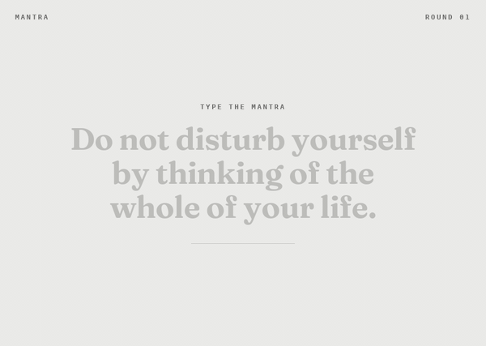

# Mantra

A desktop app that has you type a short mantra, then sit with it for a minute before the next one.



- Type the mantra shown. Case is ignored; a wrong key shakes the line and you retry.
- When you finish, a 60-second rest timer runs, then a new mantra appears.

## Build

Needs Rust and the [Tauri v2 prerequisites](https://v2.tauri.app/start/prerequisites/).

```sh
cargo run            # or: just run
cargo tauri build    # installers; needs: cargo install tauri-cli --version "^2" --locked
```

`just --list` shows the other tasks.
