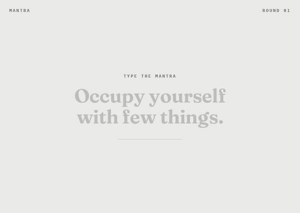

# Mantra

A desktop app that has you type a short mantra, commit to what you'll do next, then do it for a timed session before the next one.



- Type the mantra shown. Case is ignored; a wrong key shakes the line and you retry.
- Then state your commitment, e.g. `Poke the bear 20m`. A duration typed anywhere in it (`20m`, `45min`, `1h`, `1h30m`; 1 minute to 4 hours) sets the session length. Otherwise pick a preset with Tab or ↑/↓, or leave it on Auto for 20 minutes. Enter confirms.
- You have a minute to commit, shown by the draining line; Escape or running out of time returns you to the mantra.
- The session counts down under your commitment, then a new mantra appears. End session skips to the end.

## Build

Needs Rust and the [Tauri v2 prerequisites](https://v2.tauri.app/start/prerequisites/).

```sh
cargo run            # or: just run
cargo tauri build    # installers; needs: cargo install tauri-cli --version "^2" --locked
```

`just --list` shows the other tasks.
